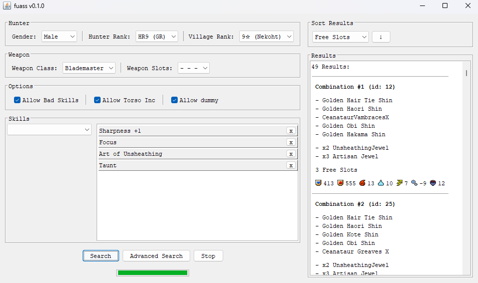
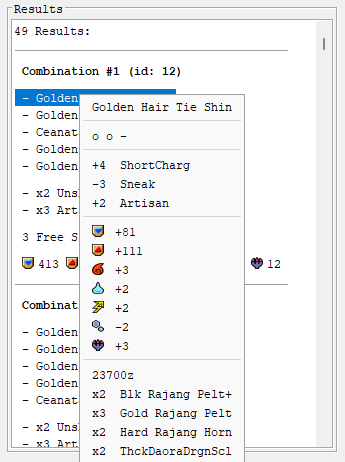

# fuass (Freedom Unite Armor Set Searcher)

    
  
  
  

A desktop tool for Monster Hunter Freedom Unite (MHFU) that finds optimal armor
combinations for a given set of target skills.

This project is inspired by [Athena's ASS](https://github.com/AthenaADP/MHFU-ASS),
another MHFU armor set searcher that served as reference for features and UI design.

## Features

- Search armor sets by target skills, rank, gender, and weapon class.
- Support for searching both positive and negative skills.
- Results sortable by defense, resistances, free slots, or extra skills.
- Each combination shows a full skill point summary.
- Detailed popup info for each armor piece and decoration: stats, skill points, and crafting materials.

## Planned Features

- [ ] Accurate hunter and village rank filters.
- [ ] Advanced Search: filter by specific armor/decoration or exclude them.

## Screenshots

## Requirements

To run the `.jar` or to build from source:
- JDK 26 or higher

## Usage

**Windows (no Java required):** download and extract the `.zip` file
from the latest release and run `fuass.exe`.

**Cross-platform (Java required):** download the `.jar` file from the latest
release and run:

    java -jar fuass_vX.X.X.jar

## Acknowledgements

- Inspired by [Athena's ASS](https://github.com/AthenaADP/MHFU-ASS).
- Game data obtained thanks to [@gaugustini](https://github.com/gaugustini), 
  from [Monster Hunter Freedom Unite Database](https://github.com/Kolyn090/mhfu-db)
  and the android app [MHFU Database](https://github.com/gaugustini/MHFUDatabase).
- The MHFU community, especially Arxx's Athenaeum Discord server.
- Developed with assistance from AI.

## License

This project is licensed under the [MIT License](LICENSE).